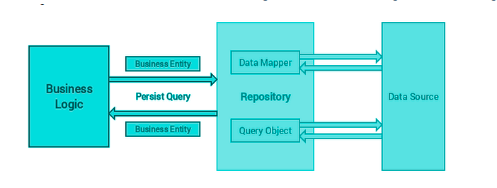

* Why would a developer choose to make data models?
    - Higher quality. Just as architects consider blueprints before constructing a building, you should consider data before building an app. 
    - Reduced cost. I can build applications at lower cost via data models. Data modeling typically consumes less than 10 percent of a project budget.
    -  Quicker time to market. I can also build software faster by catching errors early. 

* What purpose do CRUD operations serve?
    - The acronym CRUD refers to all of the major functions that are implemented in relational database applications. Each letter in the acronym can map to a standard Structured Query Language (SQL) statement, Hypertext Transfer Protocol (HTTP) method (this is typically used to build RESTful APIs) or Data Distribution Service (DDS) operation.

*  What kind of database is Postgres? What kind of database is MongoDB?
    ###### MongoDB
    - MongoDB generally stores the data like documents and represented in a binary form which is called binary JSON. 
    - MongoDB has features like its support fields, range queries, etc. MongoDB follows mainly the document data model which helps developers to connect with the application code directly.
    ###### PostgreSQL
    - PostgreSQL is developed by the PostgreSQL Global Development group. It was initially released in the year 1996. It is mainly written in C language only.
    - In PostgreSQL, the database can be defined earlier based on the requirements. The information or data can be stored in separate tables accordingly. PostgreSQL also provides security based on the role of the user. The permissions can be granted and revoked on the users as well as groups.
* What is Mongoose and why do we need it?
    -Mongoose is an Object Data Modeling (ODM) library for MongoDB and Node.js. It manages relationships between data, provides schema validation, and is used to translate between objects in code and the representation of those objects in MongoDB.
* Define three related pieces of data in a possible application. An example for a store application might be Product, Category and Department. Describe the constraints and rules on each piece of data and how you would relate these pieces to each other. For example, each Product has a Category and belongs in a Department.

### What is :

* database: A database is an organized collection of data, generally stored and accessed electronically from a computer system. Where databases are more complex they are often developed using formal design and modeling techniques.
* data model : A data model (or datamodel)is an abstract model that organizes elements of data and standardizes how they relate to one another and to the properties of real-world entities. For instance, a data model may specify that the data element representing a car be composed of a number of other elements which, in turn, represent the color and size of the car and define its owner.
* CRUD : In computer programming, create, read, update, and delete (CRUD) are the four basic functions of persistent storage. Alternate words are sometimes used when defining the four basic functions of CRUD, such as retrieve instead of read, modify instead of update, or destroy instead of delete.
* schema : A schema in a SQL database is a collection of logical structures of data. The schema is owned by a database user and has the same name as the database user. From SQL Server 2005, a schema is an independent entity (container of objects) different from the user who creates that object.
* sanitize : Sanitization is the process of removing sensitive information from a document or other message (or sometimes encrypting it), so that the document may be distributed to a broader audience.
* SQL : is a domain-specific language used in programming and designed for managing data held in a relational database management system (RDBMS), or for stream processing in a relational data stream management system (RDSMS). It is particularly useful in handling structured data
* A NoSQL (originally referring to "non SQL" or "non relational") database provides a mechanism for storage and retrieval of data that is modeled in means other than the tabular relations used in relational databases. 
* what is Object Relation Mapping (ORM) : Object-relational mapping (ORM, O/RM, and O/R mapping tool) in computer science is a programming technique for converting data between incompatible type systems using object-oriented programming languages. This creates, in effect, a "virtual object database" that can be used from within the programming language. There are both free and commercial packages available that perform object-relational mapping, although some programmers opt to construct their own ORM tools.

### here is a coparison for using mongodb-memory-server package :

- No need for mocks: Your code is directly executed using the in-memory database, exactly the same as using your regular database.
- Faster development: Given that I don't need to build a mock for every operation and outcome but only test the query, I found the development process to be faster and more straightforward.
- More reliable tests: You're testing the actual code that will be executed on production, instead of some mock that might be incorrect, incomplete or outdated.
- Tests are easier to build: I'm not an expert in unit testing and the fact that I only need to seed the database and execute the code that I need to test made the whole process a lot easier to me.

## The Repository Design Pattern

How can I use some pattern with some technology?

- the design patterns do not depend on specific technology, framework or programming language. In Software Engineering a design pattern is a reusable solution to a general problem occurring in a given context in software design. A design pattern is not a design which is directly transferred into code(source or machine).

#### The separation of data access from business logic have many benefits. Some of them are:

Centralization of the data access logic makes code easier to maintain
Business and data access logic can be tested separately
Reduces duplication of code
A lower chance for making programming errors.

### what do I learn??

# Testing Node.js + Mongoose with an in-memory database

- i learned from the article that if we want to test our code when we using mongo it takes a alot of time and some times the queries may change.
so there is a package called  mongodb-memory-server which helps ur store our data in the memory MongoDB process to test our mongoose logic without having to create any mocks.

[Home Page](https://osamamousa204.github.io/reading-notes-401/)
